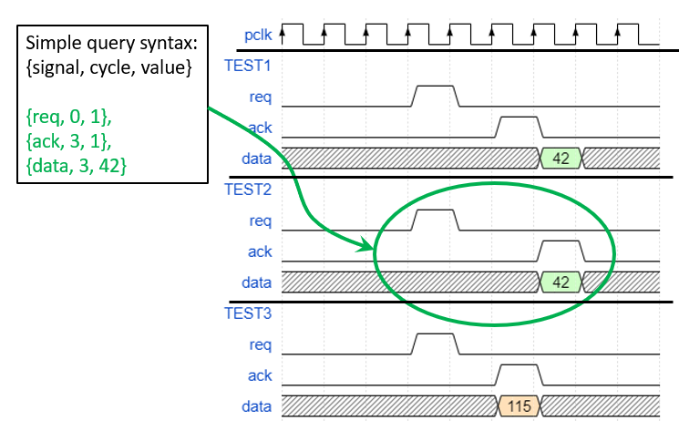

# The problem
Assume you have a collection of test results, including wave files, from your nightly/weekly regression, and you now want to check if any of these wave files contains a specific case that interests you. This might happen because you'd like to see how the design or testbench behave in that given case, or you're curious about whether a given situation is covered at all. 
The text-book solution would be to add a testbench coverpoint, or an assertion, but that solution is not a great one in practice: coding either a coverpoint or an assertion could end up taking quite a bit of effort, and both of them might contain bugs and require a few iterations, hence distracting from the main task and becoming a task in their own right. 
Another light weight option often used is adding some debug messages in - this option will also require rerunning, and might also require a few iterations, as placing a message exactly in the time and place that interests you might take a bit of fine tuning. What we're after is a solution that allows us quick iteration without rerunning. 

# A solution
Wave searcher is an open source solution that allows searching multiple wave files very quickly. It works as follows:

* Data is read from multiple wave files into a hash stored in memory, using python
* Once data has been read into a python hash, it can be searched using simple python queries.
* A small flask server can be kicked of, allowing multiple users to search the same data.

Step #1 usually takes a bit of time (see below) because we're reading a lot of data from many files into memory. Once data has been read into memory, however, searching it is very fast: 1-2 seconds for 100's of wave files. Note that a possible alternative to keeping the data in memory would be to keep it in a database, but this is not implemented here.

## Reading the data
To search the data, it must first be read into memory. The time it takes to read the data depends on the number of signals you'd like to read, and the length of the test. Reading all inputs/outputs for a long (15-20 min) big cluster test, takes about 15 seconds. short tests take 1-2 seconds. 
Since this step can take a bit of time if you have 100's of tests (half an hour to an hour), I have found it useful to read data that would be interesting to multiple users and then keep it in memory for a few days before refreshing. Multiple users could search the data via a small flask server.

[This jupyter notebook](https://github.com/avidan-efody/wave_searcher/blob/main/examples/search_wavefiles.ipynb) shows how to load the data and explains each step, and how it can be configured. Basically you need to define the signals you want to extract (you could match an entire scope, or all signals matching various regexps), and the directory containing the wave files, and that's it. Once you've done this you run the extraction step and wait a bit.

## Searching the data
When data has been read into memory you can search it using simple queries. The same jupyter notebook shows an example queriy explained. See also a pic of that notebook below.

## Allowing other users to access data
The notebook can also start a simple flask server, that allows queries to be submitted by other users from command line. The code under client/ will send a local query string to a flask server and print the results. Edit the file to change the port/server used.

